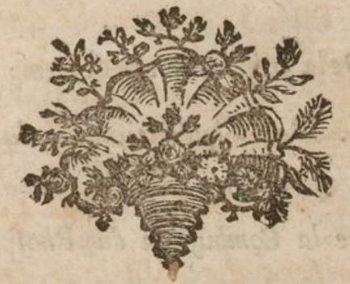

# Elementary Treatise of Chemistry

Contents of Lavoisier's Elementary Treatise of Chemistry

Source: https://gallica.bnf.fr/ark:/12148/btv1b8615746s#

## TABLE DES CHAPITRES

Discours Préliminaire, page v

### PREMIERE PARTIE.

De la formation des fluides aeriformes ℇ de la formation des acides.

CHAP. I. Des combinaiʃons du calorique ℇ de la formation des fluides élaʃtiques aériformes, 1

CHAP. II. Vues générales ʃur la formation ℇ la conʃtitution de l'amtoʃphére de la terre, 28

CHAP. III. Analyʃe de l'air de l'amtoʃphére: ʃa réʃolution en deux fluides élaʃtiques, l'un reʃpirable, l'autre non reʃpirable, 33

CHAP. IV. Nomenclature des différentes parties conʃtitutives de l'air de l'amtoʃphére, 51

CHAP. V. De la décompoʃition du gaz oxigéne par le ʃoufre, le phoʃphore ℇ le charbon, ℇ de la formation des acides en général, 57

CHAP. VII. De la décompoʃition du Gaz oxygéne par les métaux, ℇ de la formation des Oxides métalliques, 82

CHAP. VIII. Du principe radical de l'Eau, ℇ de ʃa décompoʃition par le charbon ℇ par le fer, 87

CHAP. IX. De la quantité de Calorique qui fe dégage des differéntes eʃpéces de combuʃtion, 103

- Combuʃtion du Charbon, 108
- Combuʃtion du Gaz hydrogéne, 109
- Formation de l'Acide nitrique, ibid.
- Combuʃtion de la Bougie, 112
- Combuʃtion de l'Huile d'olive, 113

CHAP. X. De la combinaiʃon des Subʃtances combuʃtibles les unes avec les autres, 116

CHAP. XI. Conʃiderations ʃur les Oxides ℇ les Acides à pluʃieurs baʃes, ℇ ʃur la compoʃition des matiéres végétales ℇ animales, 123

CHAP. XII. De la décompoʃition des matiéres végétales ℇ animales par l'aćtion du feu, 132

CHAP. XIII. De la décompoʃition des Oxides végétaux par la fermentation vineuʃe, 139

CHAP. XIV. De la fermentation putride, 153

CHAP. XV. De la fermentation acéteuʃe, 159

CHAP. XVI. De la formation de Sels neutres, ℇ des différentes baʃes qui entrent dans leur compoʃition, 162

- De la Potaʃʃe, 164
- De la Soude, 169
- De l'Ammoniaque, 170
- De la Chaux, de la Magnéʃie, de la Baryte ℇ de l'Alumine, 172
- Des Subʃtances métalliques, 173

CHAP. XVII. Suite des réflexions ʃur les baʃes ʃalifiables, ℇ ʃur la formation des Sels neutres, 179

### SECONDE PARTIE.

De la Cominaisʃon des Acides avec les baʃes ʃalifibles, ℇ de la Formation des Sels neutres.

Avertissement, 189

Tableau des Subʃtances ʃimples, 192

- Obʃervations, 193

Tableau des Radicaux ou baʃes oxidables ℇ acidifiables, compoʃés, qui entrent dans les combinaiʃons à la maniére des ʃbuʃtances ʃimples, 196

- Obʃervations, 197
- Obʃervations ʃur les combinaiʃons de la lumiére ℇ du calorique avec différentes ʃubʃtances, 200

Tableau des combinaiʃons binaries de l'oxygéne avec les ʃubʃtances métalliques ℇ non métalliques oxidables ℇ acidifiables, 203

- Obʃervations, ibid.

Tableau des combinaiʃons de l'Oxygéne avec les radicaux compʃés, 208

- Obʃervations, 209

Tableau des combinaiʃons binaries de l'Azote avec les ʃubʃtances ʃimples, 212

- Obʃervations, 213

Tableau des combinaiʃons binaries de l'Hydrogéne avec les ʃubʃtances ʃimples, 216

- Obʃervations, 217

Tableau des combinaiʃons binaries du Soufre non oxygéne avec les ʃubʃtances ʃimples, 220

- Obʃervations, 221

Tableau des combinaiʃons binaries du Phoʃphore non oxygéne avec les ʃubʃtances ʃimples, 222

- Obʃervations, 223

Tableau des combinaiʃons binaries du Charbon non oxygéne avec les ʃubʃtances ʃimples, 226

- Obʃervations, 227
- Obʃervations ʃur les radicaux muriatique, fluorique ℇ boracique, ℇ ʃur leurs combinaiʃons, 229
- Obʃervations ʃur la combinaiʃon de métaux les uns avec les autres, 230

Tableau des combinaiʃons de l'Azote ou Radical nitique, porté à l'état d'acide nitreux par la combinaiʃon d'une ʃuffiʃante quantité d'oxygéne, avec les baʃes ʃalifiables, dans l'ordrede leur affinité avec cet acide, 231

Tableau des combinaiʃons de l'Azote complettement ʃaturé d'oxygéne, ℇ porté à l'état d'acide nitrique, avec les baʃes ʃalifiables, dans l'ordre de leur affinité avec cet acide, 232

- Obʃervations, 233

Tableau des combinaiʃons de l'Acide ʃulfurique ou Soufre oxygéne avec les baʃes ʃalifiables dans l'ordre de leur affinité avec cet acide, par la voie humide, 238

- Obʃervations, 240

Tableau des combinaiʃons de l'Acide ʃulfureux avec les baʃes ʃalifiables dans l'ordre de leur affinité avec cet acide, 243

- Obʃervations, 244

Tableau des combinaiʃons du Phoʃphore qui a reçuun premier degré d'oxygénation, ℇ qui a été porté à l'état d'Acide phoʃphoreux, avec les baʃes ʃalifiables dans l'ordre de leur affinité avec cet acide, 246

Tableau des combinaiʃons du Phoʃphore ʃaturé d'oxygéne, ou Acide phoʃphorique avec les ʃubʃtances ʃalifiables dans l'ordre de leur affinité avec cet acide, 247

- Obʃervations, 248

Tableau des combinaiʃons du Radical carbonique oxygéne, ou Acide carbonique avec les baʃes ʃalifiables dans l'ordre de leur affinité avec cet acide, 250

- Obʃervations, 251

Tableau des combinaiʃons du Radical muriatique oxygéne, ou Acide muriatique avec les baʃes ʃalifiables dans l'ordre de leur affinité avec cet acide, 253

Tableau des combinaiʃons de l'Acide muriatique oxygéne avec les différentes baʃes ʃalifiables avec leʃquelles il eʃt ʃuʃceptible de s'unir, 254

- Obʃervations, 255

Tableau des combinaiʃons de l'Acide nitro-muriatique avec les baʃes ʃalifiables, rangées par ordre alphabétique, attendu que les affinités de cet acide ne ʃont point aʃʃez connues, 258

- Obʃervations, 259

Tableau des combinaiʃons du Radical fluorique oxygéne, ou Acide fluorique avec les baʃes ʃalifiables, dans l'ordre de leur affinité avec cet acide, 261

- Obʃervations, 262

### TROISEME PARTE.

Deʃcription des Appareils ℇ des Opérations manuelles de la Chimie.

Introduction, 323

CHAP. I. Des inʃtruments propres à déterminer le poids abʃolu ℇ la peʃanteur ʃpécifique des corps ʃolides ℇ liquides, 327

CHAP. II. De la Gazométrie, ou de la meʃure du poids ℇ du volume des ʃubʃtances aériformes, 342

- §. I. Deʃcription des Appareils pneumato ~ chimiques, ibid.
- §. II. Du Gazometre, 346
- §. III. De quelques autres maniéres de meʃurer le volume des Gaz, 360
- §. IV. De la maniére de ʃéparer les unes des autres les différentes eʃpéces de Gaz, 365
- §. V. Des correćtions à faire au volume des Gaz obtenus dans les expériences, relativement à la preʃʃion de l'atmoʃphere, 370
- §. VI. Des correćtions relatives aux différens degrés du Thermométre, 378
- §. VII. Modéle de calcul pour les correćtions relatives au degré de preʃʃion ℇ de température, 380
- §. VIII. De la maniere de déterminer le poids abʃoludes différens Gaz, 384

CHAP. III. Des Appareils relatifs à la meʃure du Calorique, 387

- Deʃcription du Calorimétre, ibid.

CHAP. IV. De opérations purement mécaniques qui ont pour objet de diviʃer les corps, 403

- §. I. De la Trituration, de la Porphiriʃation, ℇ de la Pulvériʃation, ibid.
- §. II. Du Tamiʃage ℇ du Lavage, 409
- §. III. De la Filtration, 412
- §. IV. De la Décantation, 419

CHAP. V. Des moyens que la Chimie emploie pour écarter les unes des autres les molécules des corps ʃans les décompoʃer, ℇ réciproquement pour les réunir, 422

- §. I. De la Solution des Sels, 423
- §. II. De la Lixiviation, 428
- §. III. De l'Evaporation, 431
- §. IV. De la Criʃtailliʃation, 436
- §. V. De la Diʃtillation ʃimple, 442
- §. VI. De la Sublimation, 448

CHAP. VI. Des Diʃtillations pneumato-chimiques, des Diʃʃolutions métalliques, ℇ de quelques autres opérations qui exigent des Appareils trés-compliqués, 449

- §. I. Des Diʃtillations compoʃées, ℇ des Diʃtillations pneumato-chimiques, 449
- §. II. Des diʃʃolutions métalliques, 458
- §. III. Des Appareils relatifs aux fermentations vineuʃe ℇ putride, 461
- §. IV. Appareil particulier pour la décompoʃition de l'eau, 465
- §. V. De la préparation ℇ de l'emploi des Luts, 468

CHAP. VII. Des Opérations relatives à la combuʃtion proprement dite ℇ à la détonation, 478

- §. I. De la Combuʃtion du Phoʃphore ℇ du Charbon, 482
- §. II. De la Combuʃtion des Huiles, 493
- §. III. De la Combuʃtion de l'Eʃprit - de - vin ou Alkcol, 501
- §. IV. De la Combuʃtion de l'Ether, 503
- §. V. de la Combuʃtion du Gaz hydrogéne, ℇ de la Formation de l'Eau, 506
- §. VI. De l'Oxidation de Métaux, 513
- §. VII. De la Détonation, 524

CHAP. VIII. Des Inʃtruments néceʃʃaires pour opérer ʃur les corps à de trés - hautes températures, 534

- §. I. De la Fuʃion, ibid.
- §. II. Des Fourneaux, 537
- §. III. Des moyens d'augmenter conʃidérablement l'aćtion du feu, en ʃubʃtituant le gaz oxygéne à l'air de latmoʃphere, 552

